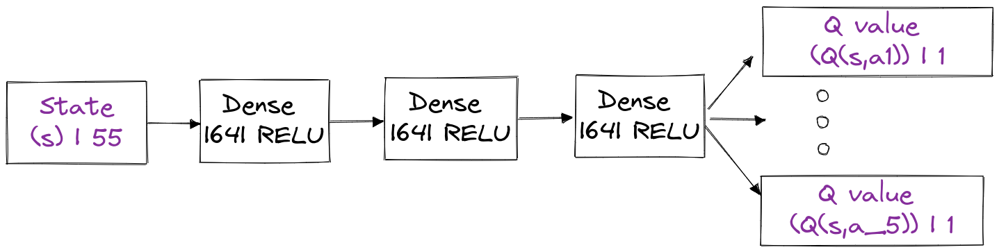
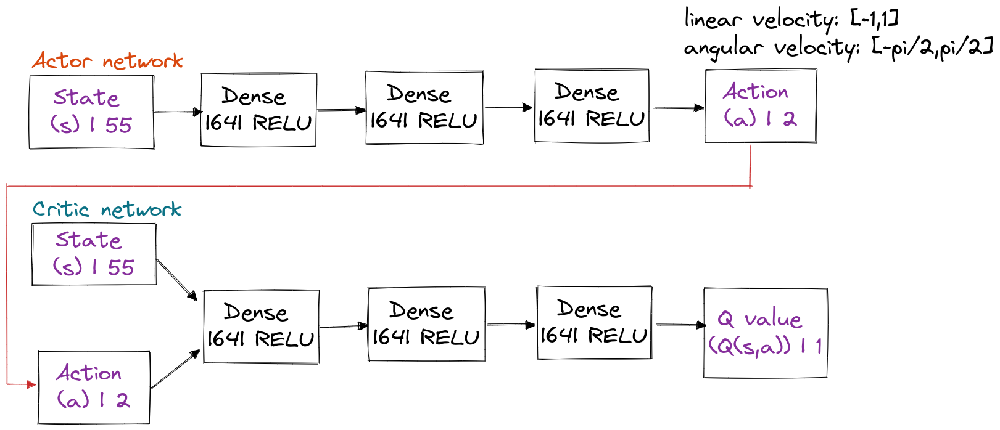

# RL4TurtleBot3Navigation
> Use deep RL algorithms (SAC, DQN) to learn how turtlebot3 navigates in obstacle environments.

SAC agent navigates in non-obstacle environment:


DQN agents navigates in static obstacle environment:


## Table of Contents
* [Overview](#overview)
* [Requirements](#requirements)
* [Training the Model](#training-the-model)

## Overview
This repository is for my internship project which contains pytorch implementation (used stable baselines 3) to train a reinforcement learning navigation model. The robot is trained in Gazebo simulator. 

1. Input
* Past and current Lidar: 24 samples from 0 to 359 degree
* Past and current velocity: angular and linear velocity.
* Current heading, distance to target: computed by using Robot Odometry.
* Lifetime: the time remaining to live (200 max timesteps per target).
```
Therefore, state dims = 2 * 24(lidar) + 2 * 1 (linear velocity) + 2 * 1(angular velocity) + 1(heading) + 1 (distance) + 1(lifetime) = 55 
```

2. Action:
* Discrete Action:
    * Fixed linear velocity (0.2 m/s):
    * Angular Velocity: 5 values: {-1.5, -0.75, 0, 0.75, 1.5} rad/s
* Continuous Action:
    * Linear velocity: [-1,1] m/s
    * Angular velocity: [-π/2,π/2] rad/s

3. Models
* DQN models:

* SAC models:


4. Rewards:
* Primary rewards:
   * Target reward
   * Collision reward
     
* Secondary rewards: 
   * Heading & speed
   * Sharp turn
   * Continuity 
   * Timeout


## Requirements
1. Ubuntu 20.04 LTS.
2. Python 3.
3. ROS Neotic.
4. Gazebo simulator.
5. Some ROS packages: turtlebot3, openai_ros,...

## Training the Model
First, run the stage simulator: 
```
roslaunch turtlebot3_gazebo turtlebot3_stage_2.launch 
```
In a separate terminal, run the training code: 
```
roslaunch my_turtlebot3_openai_example my_sb3_dqn_nav.launch
```
